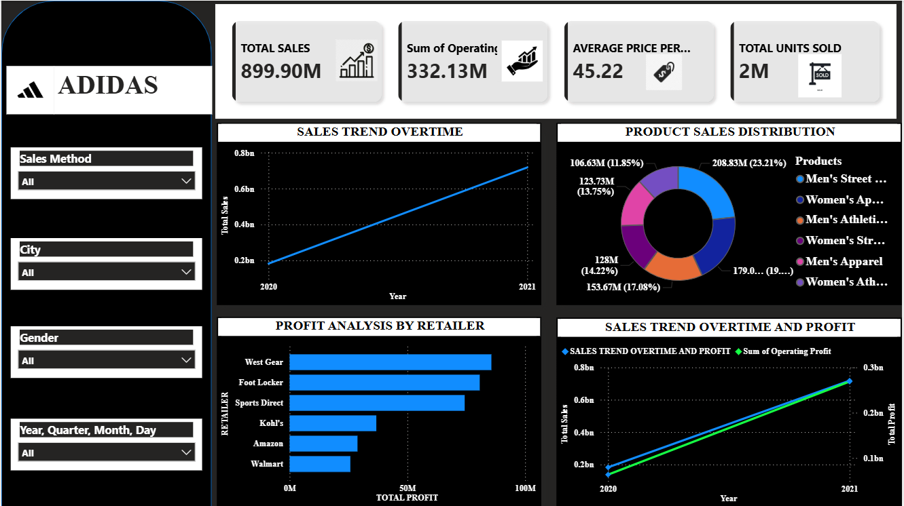
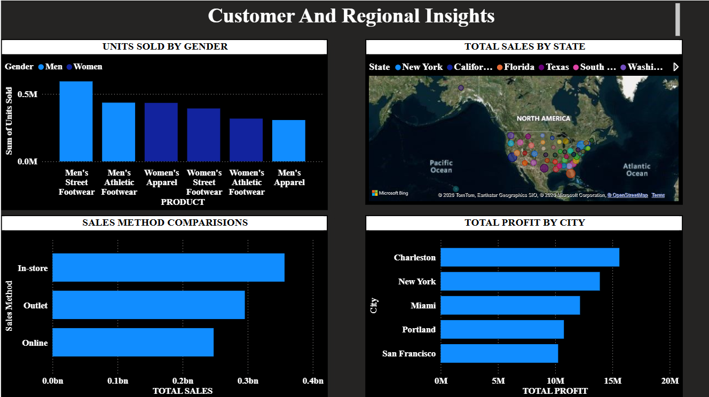
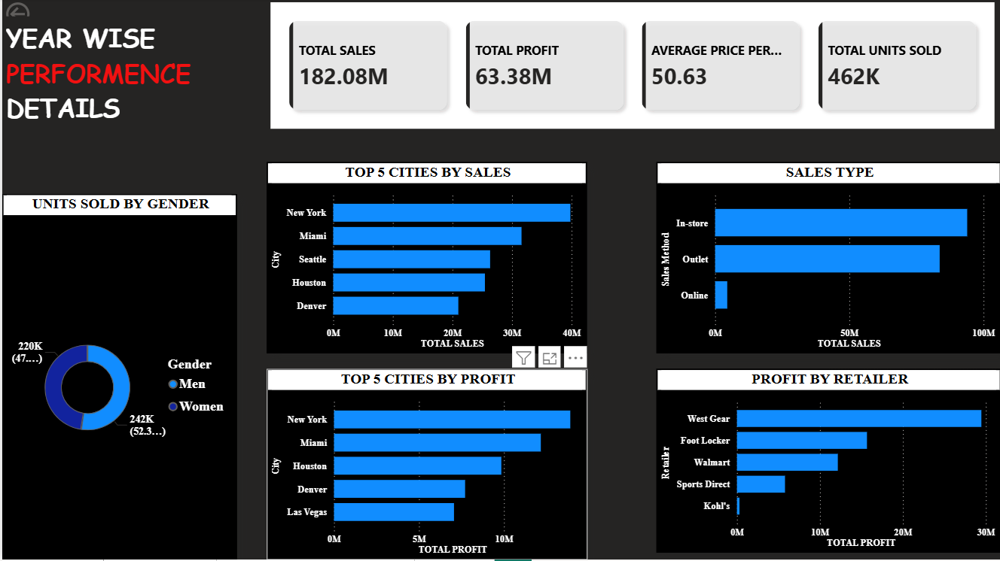

🔹 Project Overview

This project analyzes Adidas US sales data using Power BI to understand sales performance, customer behavior, and regional trends.

🔹 Key Features

KPI metrics: Total Sales, Profit, Units Sold, Avg Price

Customer analysis (Men vs Women)

Sales channel analysis (Online, Outlet, In-store)

Regional analysis (State & City level)

Drill-through functionality for detailed insights

🔹 Tools Used

Power BI

Excel

🔹 Insights

Identified top-performing retailers and cities

Analyzed most effective sales channels

Provided insights for data-driven decision making

## 📊 Dashboard Preview

### 🔹 Executive Overview

### 🔹 Customer & Regional Insights

### 🔹 Year-wise Performance

